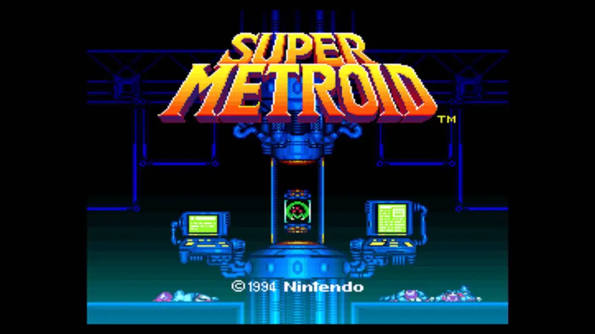

# Super Metroid Route Optimizer

This project is a route optimization tool for Super Metroid that helps players find the most efficient path through the game based on a predefined sequence of operations.

## Overview

The route optimizer takes a CSV file containing the desired order of operations (items, upgrades, and objectives) and calculates the optimal path through the game's map to complete these objectives in the specified order. The tool considers:

- Room connections and transitions
- Required items and abilities for each room
- Time optimization for speedruns
- Logical sequence of upgrades

## Current Route Structure

The default route is defined in `route.js` and includes:
- Starting point (Landing Site)
- Sequence of rooms to visit
- Specific positions within each room
- Key locations like:
  - Morph Ball Room
  - First Missile Room
  - Bomb Torizo Room

## Usage

1. Define your desired sequence of operations in the CSV file
2. Run the optimizer to calculate the optimal route
3. The tool will output the most efficient path through the game

## Development

This project is currently under development. The route structure is being built out to include more rooms and optimize the pathfinding algorithm.

## Contributing

Feel free to contribute by:
- Adding more room definitions
- Improving the optimization algorithm
- Adding new features or functionality
- Reporting bugs or suggesting improvements 